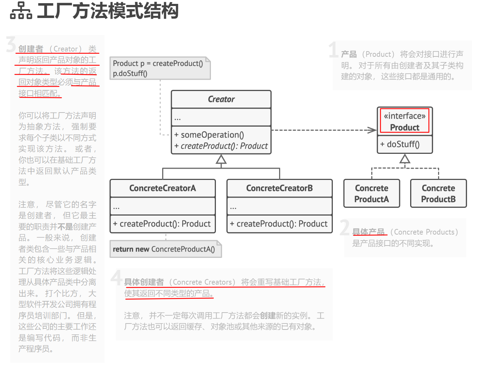

**工厂方法模式**是一种创建型设计模式， 其在父类中提供一个创建对象的方法， 允许子类决定实例化对象的类型。

工厂方法定义了一个方法， 且必须使用该方法代替通过直接调用构造函数来创建对象 （ new操作符） 的方式。 子类可重写该方法来更改将被创建的对象所属类。

**动机（Motivation）**
> - 在软件系统中，经常面临着创建对象的工作；由于需求的变化，需要创建的对象的具体类型经常变化。
> - 如何应对这种变化？如何绕过常规的对象创建方法（new），提供一种"封装机制"来避免客户程序和这种"具体对象创建工作"的紧耦合。

**模式定义**
> 定义一个用于创建对象的接口，让子类决定实例化哪一个类。工厂方法使得一个<font color = 'red'>类的实例化延迟(目的：解耦，手段：虚函数)到子类</font>。
> 
**要点总结**
> - 工厂方法模式用于隔离类对象的使用者和具体类型之间的耦合关系。面对一个经常变化的具体类型，紧耦合关系(new)会导致软件的脆弱。
> - 工厂方法模式通过面向对象的手法，将所要创建工作的具体对象延迟到子类，从而实现一种扩展(而非更改)策略，较好的解决了这种紧耦合关系。
> - 工厂方法模式解决'<font color = 'red'>单个对象</font>'的需求变化。缺点在于要求创建方法/参数相同。



**本例说明了工厂方法设计模式的结构并重点回答了下面的问题：**
它由哪些类组成？
这些类扮演了哪些角色？
模式中的各个元素会以何种方式相互关联？

#### 伪代码(C++)
``` C++
/**
 * Product接口声明了所有具体产品必须实现的操作
 */
class Product {
 public:
  virtual ~Product() {}
  virtual std::string Operation() const = 0;
};

/**
 * 具体产品提供Product接口的各种实现
 */
class ConcreteProduct1 : public Product {
 public:
  std::string Operation() const override {
    return "{Result of the ConcreteProduct1}";
  }
};

class ConcreteProduct2 : public Product {
 public:
  std::string Operation() const override {
    return "{Result of the ConcreteProduct2}";
  }
};

/**
 * 创建者类声明了工厂方法，该方法应返回Product类的对象。
 * 创建者的子类通常会提供此方法的实现。
 */
class Creator {
  /**
   * 注意：创建者也可能提供工厂方法的默认实现
   */
 public:
  virtual ~Creator(){};
  virtual Product* FactoryMethod() const = 0;
  
  /**
   * 需要特别指出的是，尽管名称中包含"创建者"，
   * 但其主要职责并不是创建产品。通常它包含一些
   * 依赖于工厂方法返回的Product对象的核心业务逻辑。
   * 子类可以通过重写工厂方法并返回不同类型的产品，
   * 间接改变这些业务逻辑。
   */

  std::string SomeOperation() const {
    // 调用工厂方法创建Product对象
    Product* product = this->FactoryMethod();
    // 使用产品
    std::string result = "Creator: The same creator's code has just worked with " + product->Operation();
    delete product;
    return result;
  }
};

/**
 * 具体创建者重写工厂方法以改变返回产品的类型
 */
class ConcreteCreator1 : public Creator {
  /**
   * 注意：方法签名仍然使用抽象产品类型，
   * 即使实际返回的是具体产品。这使得创建者可以保持独立于具体产品类
   */
 public:
  Product* FactoryMethod() const override {
    return new ConcreteProduct1();
  }
};

class ConcreteCreator2 : public Creator {
 public:
  Product* FactoryMethod() const override {
    return new ConcreteProduct2();
  }
};

/**
 * 客户端代码通过基类接口与具体创建者实例交互。
 * 只要客户端始终通过基类接口与创建者交互，
 * 就可以向其传递任何创建者的子类
 */
void ClientCode(const Creator& creator) {
  // ...
  std::cout << "Client: I'm not aware of the creator's class, but it still works.\n"
            << creator.SomeOperation() << std::endl;
  // ...
}

/**
 * 应用程序根据配置或环境选择具体的创建者类型
 */

int main() {
  std::cout << "App: Launched with the ConcreteCreator1.\n";
  Creator* creator = new ConcreteCreator1();
  ClientCode(*creator);
  std::cout << std::endl;
  std::cout << "App: Launched with the ConcreteCreator2.\n";
  Creator* creator2 = new ConcreteCreator2();
  ClientCode(*creator2);

  delete creator;
  delete creator2;
  return 0;
}
```

### **该工厂方法模式的实现主要体现了以下面向对象设计原则：**

1. **开闭原则（Open/Closed Principle）**
   - **体现点**：`Creator`基类和`Product`接口对扩展开放，对修改关闭
   - **代码示例**：
     ```cpp
     class ConcreteCreator3 : public Creator { // 可扩展新创建者
       Product* FactoryMethod() const override { 
         return new ConcreteProduct3(); // 无需修改现有代码
       }
     };
     ```

2. **依赖倒置原则（Dependency Inversion Principle）**
   - **体现点**：高层模块`Creator`不依赖低层具体产品，而是依赖抽象`Product`
   - **代码示例**：
     ```cpp
     class Creator {
       virtual Product* FactoryMethod() const = 0; // 依赖抽象接口
     };
     ```

3. **单一职责原则（Single Responsibility Principle）**
   - **体现点**：
     - `Creator`专注于核心业务逻辑（`SomeOperation`）
     - 具体创建者类只负责产品创建
   - **代码对比**：
     ```cpp
     // 不好的设计：混合业务逻辑和对象创建
     class BadCreator {
       void BusinessLogic() {
         Product* p = new ConcreteProduct1(); // 直接创建具体产品
         // 业务逻辑...
       }
     };
     ```

4. **里氏替换原则（Liskov Substitution Principle）**
   - **体现点**：所有具体创建者都可以透明替换基类`Creator`
   - **代码示例**：
     ```cpp
     void ClientCode(const Creator& creator) { // 接受任何子类
       creator.SomeOperation(); 
     }
     ```

5. **接口隔离原则（Interface Segregation Principle）**
   - **体现点**：`Product`接口只包含必要的最小操作
   - **代码示例**：
     ```cpp
     class Product {
       virtual std::string Operation() const = 0; // 单一职责接口
     };
     ```

6. **封装变化原则（Encapsulate What Varies）**
   - **体现点**：将对象创建过程封装在工厂方法中
   - **代码对比**：
     ```cpp
     // 未封装的代码
     void BusinessLogic() {
       Product* p;
       if(config == 1) p = new ConcreteProduct1();
       else p = new ConcreteProduct2(); // 创建逻辑与业务逻辑耦合
     }
     ```

设计原则应用效果分析表：

| 原则        | 应用场景                | 带来的优势                          | 代码体现位置              |
|-------------|-------------------------|-------------------------------------|---------------------------|
| 开闭原则    | 新增产品类型            | 系统可扩展性强                     | 具体创建者的扩展实现      |
| 依赖倒置    | 客户端与产品交互        | 降低模块间耦合度                   | Creator的抽象工厂方法     |
| 单一职责    | Creator类设计           | 提高代码可维护性                   | SomeOperation方法实现     |
| 里氏替换    | 客户端参数设计          | 增强系统灵活性                     | ClientCode函数参数类型    |
| 接口隔离    | Product接口定义         | 避免接口污染                       | Product类的精简接口       |
| 封装变化    | 工厂方法实现            | 隔离创建逻辑变化                   | FactoryMethod的虚函数设计 |

这些原则的共同作用使得该模式：
- 支持新产品类型的无缝添加
- 保持核心业务逻辑的稳定性
- 提高客户端代码的复用性
- 降低组件间的耦合度
- 增强系统的可测试性

通过这种设计，当需要新增产品类型时（如添加`ConcreteProduct3`），只需要：
1. 创建新的产品类继承`Product`
2. 创建新的创建者类继承`Creator`
3. 无需修改任何现有代码即可集成到系统中

这正是良好面向对象设计的典型特征：通过抽象和隔离变化点，使系统具备良好的扩展性和可维护性。