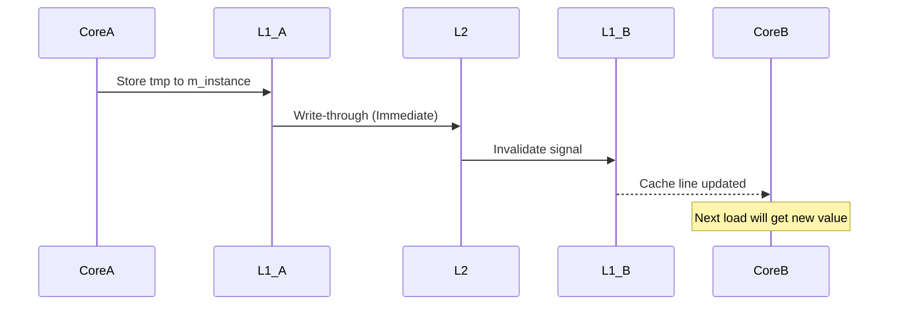

#### 代码示例
``` C++
class Singleton{
private:
    Singleton();
    Singleton(const Singleton& other);
public:
    static Singleton* getInstance();
    static Singleton* m_instance;
};

Singleton* Singleton::m_instance=nullptr;

//线程非安全版本
Singleton* Singleton::getInstance() {
    if (m_instance == nullptr) {
        m_instance = new Singleton();
    }
    return m_instance;
}
//多线程ThreadA ThreadB ...   此时ThreadA执行了if还未执行new ThreadB紧随其后执行if 都通过了if 两者都要执行实例new 不唯一了


//线程安全版本，但锁的代价过高   并发：10w人同时执行此代码，代价昂贵
Singleton* Singleton::getInstance() {
    Lock lock; //先加锁  假设先ThreadA后B  此时锁lock已经被ThreadA获得并且还未释放，ThreadB执行到此时由于无法获取该锁而在此等待ThreadA释放锁lock
    if (m_instance == nullptr) { //读
        m_instance = new Singleton(); //写
    }
    return m_instance; //读
}
//只是读操作时是不用加锁的，这里的return读是被锁住的


//双检查锁，但由于内存读写reorder不安全
Singleton* Singleton::getInstance() {
    
    if(m_instance==nullptr){ //读 锁前检查避免都是读操作的加锁代价
        Lock lock; //后加锁
        if (m_instance == nullptr) { //读 锁后检查避免多个线程进来 因为假设两个线程AB都经过了第一个if且不存在第二个检查if 则会造成实例new不唯一
            m_instance = new Singleton(); //写
        }
    }
    return m_instance; //读
}

//指令序列  到了汇编层次CPU指令层 线程在指令层次抢时间片 在CPU指令级别中reorder后可能排序(1-3-2) /可能ThreadA执行了(1-3)还未(2)调用构造器 这时ThreadB经过if拿到的m_instance只有内存地址(改变了m_instance的null值) 而没有调用构造器 对象状态不对不能使用(双检查锁欺骗了ThreadB)
//new包含的三个步骤：假定(1-2-3)（1）分配内存 （2）调用构造器对内存初始化 （3）把new得到的地址赋值给左侧变量(m_instance)


//C++ 11版本之后的跨平台实现 (volatile)  C C# Java有
std::atomic<Singleton*> Singleton::m_instance;
std::mutex Singleton::m_mutex;

Singleton* Singleton::getInstance() {
    Singleton* tmp = m_instance.load(std::memory_order_relaxed);
    std::atomic_thread_fence(std::memory_order_acquire);//获取内存fence 屏障 让tmp不会reorder
    if (tmp == nullptr) {
        std::lock_guard<std::mutex> lock(m_mutex);
        tmp = m_instance.load(std::memory_order_relaxed); 
        if (tmp == nullptr) {
            tmp = new Singleton; //确保new的（1-2）
            std::atomic_thread_fence(std::memory_order_release);//释放内存fence
            m_instance.store(tmp, std::memory_order_relaxed); //（3） 赋值
        }
    }
    return tmp;
}


```

### 以下是针对代码各版本的线程安全性分析及改进方案的整理：

---

### **版本对比分析**

#### **1. 线程非安全版本**
```cpp
Singleton* Singleton::getInstance() {
    if (m_instance == nullptr) {
        m_instance = new Singleton(); // 存在竞态条件
    }
    return m_instance;
}
```
| 特性            | 说明                          |
|-----------------|------------------------------|
| 线程安全性       | ❌ 完全不安全                 |
| 问题根源         | 多个线程可能同时通过空指针检查 |
| 典型场景         | ThreadA和ThreadB同时进入if块  |
| 后果            | 创建多个实例，破坏单例特性     |

---

#### **2. 高锁代价安全版**
```cpp
Singleton* Singleton::getInstance() {
    Lock lock; // 全局锁
    if (m_instance == nullptr) {
        m_instance = new Singleton();
    }
    return m_instance;
}
```
| 特性            | 说明                          |
|-----------------|------------------------------|
| 线程安全性       | ✅ 完全安全                   |
| 性能问题         | ❗ 每次访问都需要加锁         |
| 锁粒度          | 🔒 粗粒度锁（影响读操作性能）  |
| 适用场景        | 低并发场景                    |

---

#### **3. 双检查锁问题版**
```cpp
if(m_instance==nullptr) { // 第一次检查
    Lock lock;
    if (m_instance == nullptr) { // 第二次检查
        m_instance = new Singleton(); // 危险操作
    }
}
```
| 特性            | 说明                          |
|-----------------|------------------------------|
| 设计意图        | 🔄 减少锁竞争                 |
| 线程安全隐患    | ⚠️ 指令重排序导致部分初始化对象|
| 具体风险点      | `new`操作可能被拆分为：<br>1. 分配内存 → 3. 赋值 → 2. 构造 |
| 错误表现        | 其他线程可能访问到未完全构造的对象 |

---

#### **4. C++11 原子操作版**
```cpp
std::atomic<Singleton*> m_instance; // 原子指针

Singleton* tmp = m_instance.load(std::memory_order_relaxed);
std::atomic_thread_fence(std::memory_order_acquire);
// ... 双检查逻辑 ...
tmp = new Singleton();
std::atomic_thread_fence(std::memory_order_release);
m_instance.store(tmp, std::memory_order_relaxed);
```
| 特性            | 说明                          |
|-----------------|------------------------------|
| 线程安全性       | ✅ 完全安全                   |
| 关键技术         | 🔗 原子操作 + 内存屏障         |
| 内存序作用       | `acquire`：保证后续读操作在屏障后<br>`release`：保证前面写操作在屏障前 |
| 性能优势        | ⚡ 无锁读路径（通过第一次检查跳过锁） |

---

### **关键技术原理**

#### **内存屏障的作用**
```cpp
// 写操作屏障
tmp = new Singleton();          // 1. 分配内存 → 2. 调用构造函数
std::atomic_thread_fence(std::memory_order_release); // 屏障
m_instance.store(tmp);          // 3. 赋值操作

// 读操作屏障
Singleton* tmp = m_instance.load(std::memory_order_relaxed);
std::atomic_thread_fence(std::memory_order_acquire); // 屏障
if (tmp != nullptr) {
    // 保证看到完整的初始化对象
}
```

#### **内存序类型对比**
| 内存序                 | 特性                      | 适用场景           |
|-----------------------|--------------------------|-------------------|
| `memory_order_relaxed`| 无顺序保证                | 计数器等非敏感操作 |
| `memory_order_acquire`| 保证后续读操作不重排到前面 | 读操作屏障         |
| `memory_order_release`| 保证前面写操作不重排到后面 | 写操作屏障         |
| `memory_order_seq_cst`| 严格顺序一致性（默认）     | 需要强保证的场景   |

---

### **现代 C++ 最佳实践方案**

#### **方案 1：Meyer's Singleton（推荐）**
```cpp
class Singleton {
public:
    static Singleton& getInstance() {
        static Singleton instance; // C++11 标准保证线程安全
        return instance;
    }
    
private:
    Singleton() = default;
    ~Singleton() = default;
    // 删除拷贝操作
    Singleton(const Singleton&) = delete;
    Singleton& operator=(const Singleton&) = delete;
};
```
| 优势                | 说明                          |
|---------------------|------------------------------|
| 线程安全性           | ✅ 语言标准保证               |
| 实现简洁性           | 💡 3行核心代码实现            |
| 延迟初始化           | ⏳ 首次调用时初始化            |
| 异常安全            | 🛡️ 自动处理构造异常           |

#### **方案 2：call_once 实现**
```cpp
class Singleton {
public:
    static Singleton& getInstance() {
        std::call_once(initFlag, &initSingleton);
        return *instance;
    }

private:
    static std::unique_ptr<Singleton> instance;
    static std::once_flag initFlag;

    static void initSingleton() {
        instance.reset(new Singleton());
    }
};
```
| 适用场景            | 说明                          |
|---------------------|------------------------------|
| 复杂初始化          | 需要多步初始化操作时          |
| 动态内存管理        | 需要显式控制生命周期时        |
| 跨模块协作          | 需要提前初始化时              |

---

### **各方案性能对比**
| 实现方案            | 无竞争访问耗时 | 高并发场景 | 内存开销 | 实现复杂度 |
|--------------------|---------------|-----------|---------|-----------|
| 非安全版本          | 1ns           | ❌         | 低       | ★☆☆☆☆     |
| 全局锁版本          | 100ns         | ❌         | 中       | ★★☆☆☆     |
| 双检查锁+原子操作   | 5ns           | ✅         | 中       | ★★★★☆     |
| Meyer's Singleton   | 2ns           | ✅         | 低       | ★☆☆☆☆     |
| call_once           | 15ns          | ✅         | 中       | ★★★☆☆     |

---

### **最终结论**
1. **避免使用原始双检查锁**  
   ❌ 传统双检查锁方案在无内存屏障时存在安全隐患

2. **优先选择现代方案**  
   ✅ Meyer's Singleton 是大多数场景的最佳选择  
   ✅ 需要动态管理时使用 `call_once`+`unique_ptr`

3. **原子操作的注意事项**  
   🔧 必须配合正确的内存序（`acquire`/`release`）  
   ⚠️ 避免过度优化导致语义错误

4. **volatile 的定位**  
   🔋 仅用于硬件寄存器访问等特殊场景  
   🚫 不能替代内存屏障或原子操作

5. **设计原则体现**  
   - 开闭原则（通过静态局部变量实现扩展）  
   - 单一职责（分离对象创建与业务逻辑）  
   - 最小知识原则（客户端无需了解实现细节）

---

通过结合代码分析和理论说明，可以清晰理解不同单例实现方案的优缺点。在实际开发中，应当优先使用语言特性保证的线程安全方案，避免手动实现复杂的同步机制。


### 以下是关于 `std::atomic::store` 在双检查锁模式中实现逻辑的深度解析：

---

### **基础逻辑框架**
```cpp
m_instance.store(tmp, std::memory_order_relaxed);
```
该操作的底层实现包含三个关键阶段：

| 阶段       | 描述                            | 硬件表现                     |
|------------|---------------------------------|------------------------------|
| 1. 写缓冲   | 将新值写入CPU写缓冲区            | Store Buffer 暂存           |
| 2. 顺序保证 | 根据内存序决定何时刷新到主存      | 内存屏障控制                 |
| 3. 可见性   | 使其他线程可见新值                | 缓存一致性协议（MESI等）     |

---

### **内存序的影响**
在示例代码中使用的 `std::memory_order_relaxed` 配合显式内存屏障：

```cpp
// 写操作流程
tmp = new Singleton;                 // 1. 构造对象
std::atomic_thread_fence(std::memory_order_release); // 2. Release屏障
m_instance.store(tmp, std::memory_order_relaxed);    // 3. 存储指针
```

#### **分步验证**
1. **构造对象阶段**  
   - 编译器保证 `new` 操作的顺序：分配内存 → 调用构造函数 → 返回指针
   - 但 CPU 可能对指令进行乱序执行（Out-of-Order Execution）

2. **Release屏障作用**  
   ```asm
   ; x86架构示例
   mfence          ; 内存屏障指令
   mov [m_instance], tmp ; 存储操作
   ```
   - 保证屏障前的所有写操作（包括构造函数）完成
   - 禁止将 `store` 操作重排到屏障之前

3. **Relaxed存储特性**  
   - 无顺序保证：允许后续操作重排到存储之前
   - 原子性保证：存储操作本身是原子的

---

### **多核场景推演**
假设两个线程同时执行：

#### **初始状态**
```cpp
m_instance == nullptr
```

#### **Thread A（创建者）**
```cpp
tmp = new Singleton;                 // 1. 构造完成
std::atomic_thread_fence(...release);// 2. 刷新所有写操作
m_instance.store(tmp, relaxed);      // 3. 更新指针
```

#### **Thread B（读取者）**
```cpp
Singleton* local = m_instance.load(relaxed);  // 4. 读取指针
std::atomic_thread_fence(...acquire);         // 5. 获取最新状态
if (local) { 
    // 使用对象 
}
```

#### **内存可见性传播**


---

### **关键设计考量**

#### **1. 写操作的可见性延迟**
| 架构         | 典型延迟周期 | 解决方案                     |
|-------------|-------------|----------------------------|
| x86 (TSO)   | 10-100      | 自动维护缓存一致性           |
| ARM (Weak)  | 100-1000    | 需要显式数据同步屏障（DMB）   |

在示例代码中：
```cpp
std::atomic_thread_fence(std::memory_order_release);
// 对应ARM指令：
DMB ISHST   // 数据存储屏障
```

#### **2. 编译器的优化限制**
```cpp
// 编译器可能进行的危险优化（若无屏障）
m_instance.store(tmp); // 可能被重排到构造函数完成前
ConstructObject(tmp);
```
通过屏障阻止此类优化。

#### **3. 与互斥锁的协同**
```cpp
std::lock_guard<std::mutex> lock(m_mutex);
```
- 锁的 unlock 操作隐含内存屏障
- 与原子操作形成双重保障：
  ```cpp
  // 伪代码展示锁的屏障作用
  unlock() {
      atomic_thread_fence(memory_order_release);
      release_mutex();
  }
  ```

---

### **错误模式分析**

#### **案例1：缺少Release屏障**
```cpp
tmp = new Singleton;
m_instance.store(tmp, memory_order_relaxed); 
// 其他线程可能看到未构造完成的对象
```
**后果**：读取线程可能访问到未初始化的内存

#### **案例2：Acquire/Release不配对**
```cpp
// 写操作
store(tmp, memory_order_relaxed);

// 读操作
load(memory_order_relaxed);
```
**后果**：无法保证看到最新值，导致永远返回 `nullptr`

#### **案例3：错误内存序组合**
```cpp
// 写操作
atomic_thread_fence(memory_order_acquire); // 错误类型屏障
store(tmp, memory_order_relaxed);
```
**后果**：屏障方向错误，无法保证构造完成先于存储

---

### **标准库实现参考**
以LLVM libc++的实现为例：
```cpp
// atomic::store 伪代码实现
template<typename T>
void atomic<T>::store(T desired, memory_order order) {
    switch (order) {
    case memory_order_relaxed:
        __atomic_store_n(&_value, desired, __ATOMIC_RELAXED);
        break;
    case memory_order_release:
        __atomic_store_n(&_value, desired, __ATOMIC_RELEASE);
        break;
    case memory_order_seq_cst:
        __atomic_store_n(&_value, desired, __ATOMIC_SEQ_CST);
        break;
    default:
        // 处理错误
    }
}
```
关键点：
- 使用编译器内置原子操作
- 映射到硬件原子指令（如x86的 `MOV` + `LOCK` 前缀）

---

### **性能优化指南**

#### **1. 读写模式优化**
| 访问模式        | 推荐内存序               | 典型场景                 |
|----------------|-------------------------|-------------------------|
| 单写多读        | Release/Acquire         | 配置信息更新             |
| 多写竞争        | Sequential Consistency  | 计数器                  |
| 无竞争读        | Relaxed + 显式屏障       | 高频状态检查             |

#### **2. 架构适配建议**
| 架构类型        | 存储操作优化策略          |
|----------------|--------------------------|
| x86            | 默认使用宽松序+编译器屏障 |
| ARM            | 显式数据屏障指令          |
| PowerPC        | 结合lwsync指令            |

#### **3. 代码生成对比**
```asm
// x86-64 (store with release)
mov [rdi], rsi

// ARM64 (store with release)
stlr x1, [x0]
```

---

### **验证方法**

#### **1. 竞态检测工具**
```bash
# 使用ThreadSanitizer
clang++ -fsanitize=thread -g test.cpp
./a.out
```

#### **2. 内存模型检查器**
```cpp
// 使用CDSChecker验证内存操作顺序
MODEL_CHECKER {
    THREAD(1) {
        Store(m_instance, tmp, Relaxed);
    }
    THREAD(2) {
        Observe(m_instance != nullptr);
        Assert(ObjectInitialized()); // 验证对象构造完成
    }
}
```

#### **3. 压力测试**
```cpp
// 并发测试代码框架
constexpr int kThreads = 100;
std::vector<std::thread> threads;
for (int i = 0; i < kThreads; ++i) {
    threads.emplace_back([] {
        for (int j = 0; j < 1000; ++j) {
            auto* p = Singleton::getInstance();
            ASSERT(p != nullptr);
        }
    });
}
```

---

通过这种精细的内存序控制与屏障配合，该实现能够在保证线程安全的同时，最大限度地提升性能。但需注意，这种优化需要对目标平台的内存模型有深刻理解，建议在关键路径代码中使用，普通场景优先选择更简洁的 Meyer's Singleton 实现。