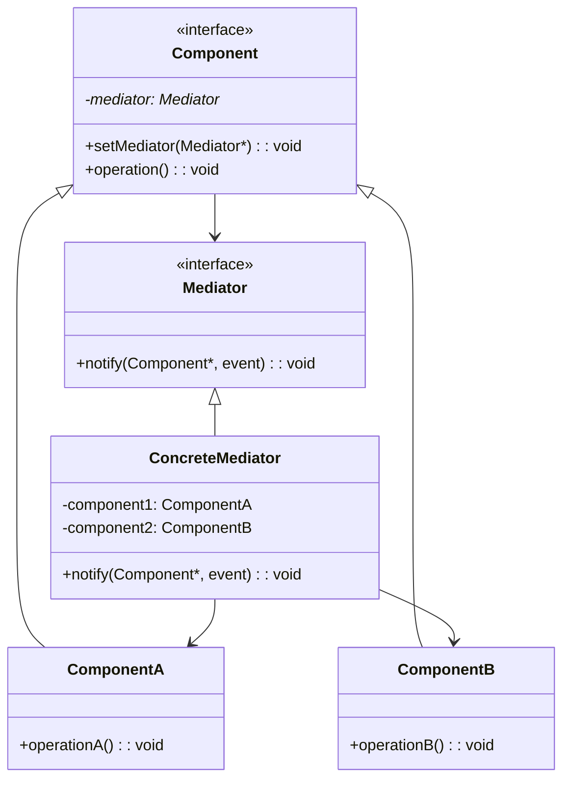

---

### **中介者模式（Mediator Pattern）详解**

#### **1. 模式定义**
**中介者模式**是一种行为型设计模式，旨在通过引入一个**中介者对象**来封装一组对象之间的交互。它通过将对象间的**直接通信**转变为通过中介者的**间接通信**，从而**降低对象间的耦合度**，使系统更易于维护和扩展。

---

#### **2. 解决的问题**
当系统中多个对象（称为**同事对象**）存在复杂的网状交互关系时：
- **直接依赖**导致代码耦合度高
- 修改一个对象可能影响多个其他对象
- 难以理解和维护交互逻辑

**示例场景**：
- 聊天室中的多个用户需要互相发送消息
- 飞机与塔台之间的通信调度
- GUI组件（按钮、输入框）的联动控制

---

#### **3. 模式结构**


---

#### **4. 核心组件**
| **角色**         | **职责**                                                                 |
|------------------|--------------------------------------------------------------------------|
| **Mediator**     | 定义中介者接口，声明协调各组件的方法（如`notify()`）                      |
| **ConcreteMediator** | 实现中介者接口，管理并协调各同事对象的交互逻辑                            |
| **Component**    | 定义同事类的接口，持有中介者的引用                                        |
| **ConcreteComponent** | 具体同事类，实现自身业务逻辑，通过中介者与其他同事对象通信                |

---

#### **5. 代码示例（C++实现）**
**场景**：实现一个聊天室系统，用户通过中介者（聊天服务器）发送消息，而非直接相互通信。

```cpp
#include <iostream>
#include <string>
#include <vector>

// 前置声明
class User;

// 中介者接口
class ChatMediator {
public:
    virtual void sendMessage(const std::string& msg, User* user) = 0;
    virtual ~ChatMediator() = default;
};

// 具体中介者：聊天服务器
class ChatServer : public ChatMediator {
private:
    std::vector<User*> users; // 管理所有用户

public:
    void addUser(User* user) {
        users.push_back(user);
    }

    void sendMessage(const std::string& msg, User* sender) override {
        for (User* user : users) {
            if (user != sender) { // 不将消息发给自己
                user->receive(msg);
            }
        }
    }
};

// 同事类接口
class User {
protected:
    ChatMediator* mediator;
    std::string name;

public:
    User(const std::string& name, ChatMediator* mediator)
        : name(name), mediator(mediator) {}

    virtual void send(const std::string& msg) = 0;
    virtual void receive(const std::string& msg) = 0;
    virtual ~User() = default;
};

// 具体同事类：普通用户
class ChatUser : public User {
public:
    ChatUser(const std::string& name, ChatMediator* mediator)
        : User(name, mediator) {}

    void send(const std::string& msg) override {
        std::cout << name << " 发送消息: " << msg << std::endl;
        mediator->sendMessage(msg, this); // 通过中介者转发
    }

    void receive(const std::string& msg) override {
        std::cout << name << " 收到消息: " << msg << std::endl;
    }
};

int main() {
    // 创建中介者（聊天服务器）
    ChatServer server;

    // 创建用户并注册到服务器
    ChatUser* alice = new ChatUser("Alice", &server);
    ChatUser* bob = new ChatUser("Bob", &server);
    ChatUser* charlie = new ChatUser("Charlie", &server);
    
    server.addUser(alice);
    server.addUser(bob);
    server.addUser(charlie);

    // 用户发送消息
    alice->send("大家好！");
    bob->send("今天天气不错。");

    // 清理资源
    delete alice;
    delete bob;
    delete charlie;

    return 0;
}
```

**输出结果**：
```
Alice 发送消息: 大家好！
Bob 收到消息: 大家好！
Charlie 收到消息: 大家好！
Bob 发送消息: 今天天气不错。
Alice 收到消息: 今天天气不错。
Charlie 收到消息: 今天天气不错。
```

---

#### **6. 模式优势**
| **优势**         | **说明**                                                                 |
|------------------|--------------------------------------------------------------------------|
| **解耦对象**     | 同事对象只需与中介者交互，无需直接依赖其他对象                            |
| **简化交互**     | 将多对多通信转化为一对多通信，逻辑更清晰                                  |
| **集中控制**     | 中介者可统一管理对象间的交互规则（如权限校验、日志记录）                  |
| **易于扩展**     | 新增同事类只需修改中介者，无需影响现有代码                                |

---

#### **7. 适用场景**
- **对象间存在复杂网状依赖**  
  例如：GUI组件联动、分布式系统节点通信
- **需要集中管理交互规则**  
  例如：聊天室的消息过滤、游戏中的战斗事件处理
- **系统需要动态调整交互关系**  
  例如：微服务架构中的服务协调

---

#### **8. 注意事项**
| **注意事项**       | **说明**                                                                 |
|--------------------|--------------------------------------------------------------------------|
| **中介者复杂度**   | 中介者可能成为“上帝对象”，需合理划分职责                                  |
| **性能瓶颈**       | 高频交互场景中，中介者可能成为性能瓶颈                                    |
| **模式选择**       | 简单交互场景使用观察者模式，复杂网状交互使用中介者模式                    |

---

#### **9. 与其他模式对比**
| **模式**         | **核心思想**                              | **适用场景**                      |
|------------------|------------------------------------------|-----------------------------------|
| **中介者模式**   | 通过中介者集中管理对象交互                | 对象间存在复杂网状依赖关系          |
| **观察者模式**   | 通过订阅/发布机制实现松散耦合             | 对象状态变化需要通知多个观察者      |
| **外观模式**     | 为子系统提供统一入口                      | 简化复杂子系统的调用接口            |

---

通过中介者模式，可以有效解决对象间复杂交互的问题，提升系统的可维护性和扩展性。在实际开发中，需根据具体场景权衡是否引入中介者，避免过度设计。