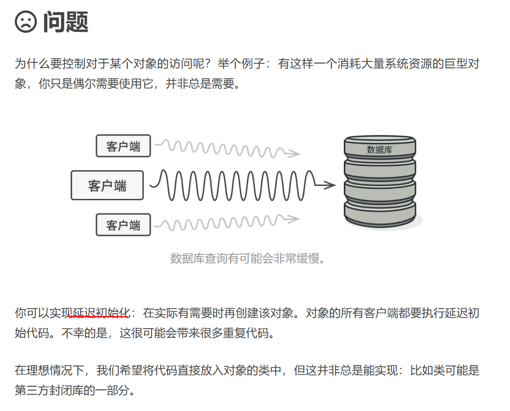
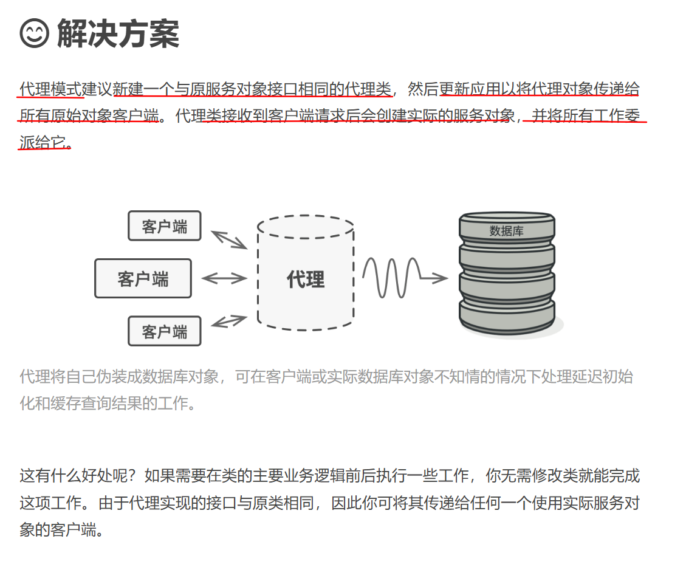
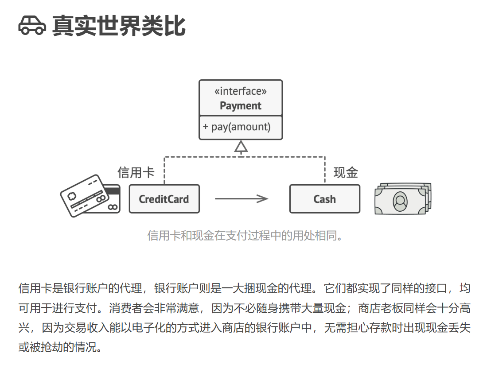
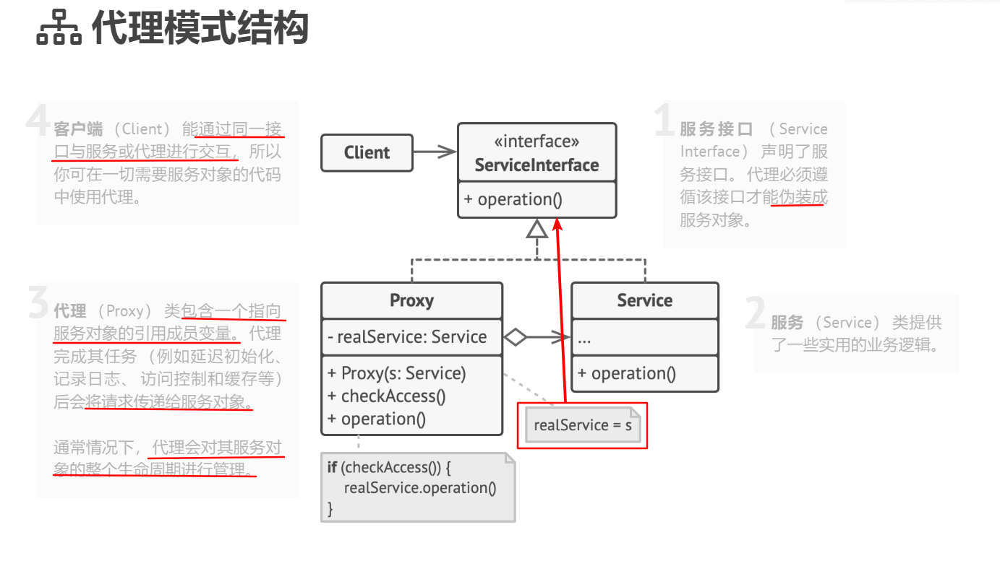
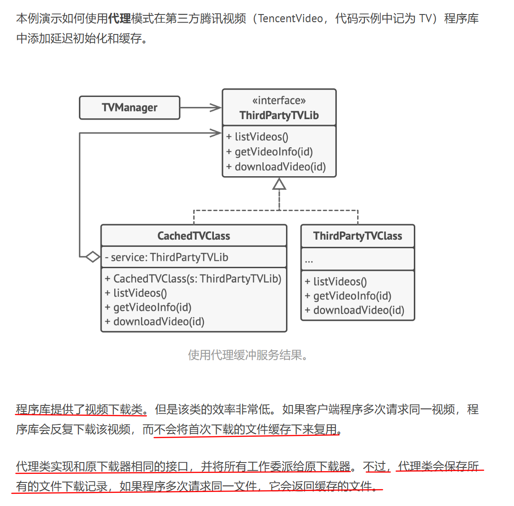
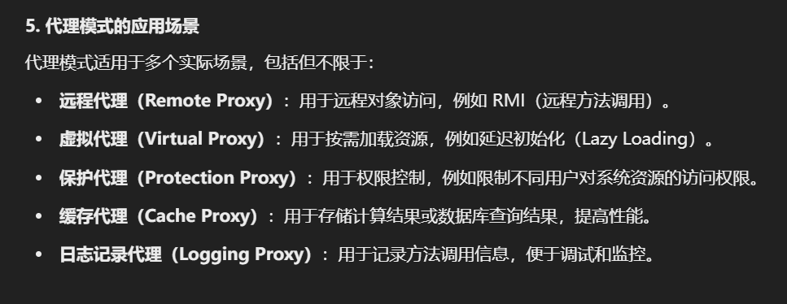

[TOC]

---
**代理模式**是一种结构型设计模式， 让你能够提供对象的替代品或其占位符。 代理控制着对于原对象的访问， 并允许在将请求提交给对象前后进行一些处理。(如安全控制，性能优化，分布式相关的方法)

**动机(Motivation)**
> - 在面向对象系统中，有些对象由于某种原因(比如创建对象的开销很大，或者某些操作需要安全控制，或者需要进程外的访问等)直接访问会给使用者、或者系统结构带来很多麻烦。
> - 如何在不失去透明操作对象的同时管理/控制这些对象特有的复杂性？增加一层间接层是软件开发中常见的解决方式。

**模式定义**
> 为其他对象提供一种代理以控制(隔离，使用接口)对这个对象的访问。





**实际的代理模式更加复杂，以下仅做参考。**




---
**代理**是一种结构型设计模式， 让你能提供真实服务对象的替代品给客户端使用。 代理接收客户端的请求并进行一些处理 （访问控制和缓存等）， 然后再将请求传递给服务对象。

代理对象拥有和服务对象相同的接口， 这使得当其被传递给客户端时可与真实对象互换。
#### **伪代码**
```C++
#include <iostream>

/**
 * 主题（Subject）接口声明了 RealSubject 和 Proxy 的公共操作。
 * 只要客户端通过该接口与 RealSubject 交互，就可以使用代理（Proxy）来替代真实主题（RealSubject）。
 */
class Subject {
 public:
  virtual void Request() const = 0;
};

/**
 * 真实主题（RealSubject）包含核心业务逻辑。
 * 通常，真实主题会执行一些重要的操作，但可能会很慢或对外部环境敏感，例如数据校正。
 * 代理（Proxy）可以在不修改真实主题代码的情况下，解决这些问题。
 */
class RealSubject : public Subject {
 public:
  void Request() const override {
    std::cout << "RealSubject: 处理请求。\n";
  }
};

/**
 * 代理类（Proxy）提供了与真实主题相同的接口。
 */
class Proxy : public Subject {
 private:
  /**
   * @var RealSubject 指向真实主题的指针
   */
  RealSubject *real_subject_;

  /**
   * 检查访问权限（在执行真实请求之前）。
   */
  bool CheckAccess() const {
    // 这里可以进行真正的访问权限检查
    std::cout << "Proxy: 在执行真实请求前检查访问权限。\n";
    return true;
  }

  /**
   * 记录访问日志。
   */
  void LogAccess() const {
    std::cout << "Proxy: 记录请求时间。\n";
  }

 public:
  /**
   * 代理对象维护对真实主题对象的引用。
   * 可以使用延迟加载，或者由客户端直接传递给代理对象。
   */
  Proxy(RealSubject *real_subject) : real_subject_(new RealSubject(*real_subject)) {}

  ~Proxy() {
    delete real_subject_;
  }

  /**
   * 代理模式的常见应用场景包括：
   * - **延迟加载**（Lazy Loading）
   * - **缓存**（Caching）
   * - **访问控制**（Access Control）
   * - **日志记录**（Logging）
   * 
   * 代理可以在执行目标方法之前进行某些操作，然后决定是否调用真实主题对象的相应方法。
   */
  void Request() const override {
    if (this->CheckAccess()) {
      this->real_subject_->Request();
      this->LogAccess();
    }
  }
};

/**
 * 客户端代码（Client Code）应当通过 Subject 接口与对象交互，
 * 这样可以同时支持真实主题和代理对象。
 * 
 * 在实际应用中，客户端通常直接使用真实主题，
 * 如果要更方便地实现代理模式，可以让代理类继承自真实主题类。
 */
void ClientCode(const Subject &subject) {
  subject.Request();
}

int main() {
  std::cout << "客户端：使用真实主题执行代码：\n";
  RealSubject *real_subject = new RealSubject;
  ClientCode(*real_subject);
  std::cout << "\n";

  std::cout << "客户端：使用代理执行相同的代码：\n";
  Proxy *proxy = new Proxy(real_subject);
  ClientCode(*proxy);

  delete real_subject;
  delete proxy;
  return 0;
}

```


### **代理模式（Proxy Pattern）分析**  

#### **1. 设计模式概述**
**代理模式（Proxy Pattern）** 是结构型设计模式之一，它允许一个类作为另一个类的接口，以控制对这个类的访问。代理对象（`Proxy`）和真实对象（`RealSubject`）都实现相同的接口（`Subject`），这样客户端可以透明地使用代理对象，而不必直接与真实对象交互。

---

#### **2. 代码结构分析**
本代码实现了一个典型的 **代理模式**，其结构如下：

1. **`Subject`（抽象主题类）：**
   - 声明了一个纯虚函数 `Request()`，作为 `RealSubject` 和 `Proxy` 的公共接口。

2. **`RealSubject`（真实主题类）：**
   - 具体实现了 `Request()`，负责执行核心业务逻辑。
   - 在 `Request()` 方法中，直接输出 `"RealSubject: 处理请求。"`

3. **`Proxy`（代理类）：**
   - 内部维护了 `RealSubject*` 类型的指针（`real_subject_`）。
   - 在 `Request()` 方法中，先检查访问权限（`CheckAccess()`），然后调用 `real_subject_->Request()`，最后记录日志（`LogAccess()`）。
   - 代理模式的作用体现在 `CheckAccess()` 和 `LogAccess()` 上，它们可以在 **不修改 `RealSubject` 代码** 的情况下，增强功能（如权限控制、日志记录等）。

4. **`ClientCode`（客户端代码）：**
   - 接受 `Subject` 类型的引用，以保持对 `RealSubject` 和 `Proxy` 的兼容性。
   - 先后使用 `RealSubject` 和 `Proxy` 来执行 `Request()`，验证代理模式的作用。

---

#### **3. 代理模式的作用**
代理模式的核心作用是 **在不修改 `RealSubject` 代码的前提下，提供额外的功能**。在这个示例中，代理模式的作用主要有：
- **访问控制（CheckAccess）**：代理可以决定是否允许访问 `RealSubject`，例如权限管理、认证等。
- **日志记录（LogAccess）**：代理可以在 `Request()` 执行前后进行日志记录，方便跟踪请求的执行情况。
- **性能优化**（延迟加载、缓存等）：虽然本例未实现，但代理模式可以用于 **按需创建对象**（如数据库连接、图像资源等），或 **缓存数据以减少开销**。

---

#### **4. 代码执行流程**
执行 `main()` 方法时：
1. **使用 `RealSubject`：**
   - `ClientCode()` 直接调用 `RealSubject::Request()`，输出：
     ```
     RealSubject: 处理请求。
     ```
   
2. **使用 `Proxy` 代理 `RealSubject`：**
   - `Proxy::Request()` 先执行 `CheckAccess()`，输出：
     ```
     Proxy: 在执行真实请求前检查访问权限。
     ```
   - 调用 `RealSubject::Request()`，输出：
     ```
     RealSubject: 处理请求。
     ```
   - 执行 `LogAccess()` 记录日志，输出：
     ```
     Proxy: 记录请求时间。
     ```

完整输出如下：
```
客户端：使用真实主题执行代码：
RealSubject: 处理请求。

客户端：使用代理执行相同的代码：
Proxy: 在执行真实请求前检查访问权限。
RealSubject: 处理请求。
Proxy: 记录请求时间。
```

---

#### **5. 代理模式的应用场景**
代理模式适用于多个实际场景，包括但不限于：
- **远程代理（Remote Proxy）**：用于远程对象访问，例如 RMI（远程方法调用）。
- **虚拟代理（Virtual Proxy）**：用于按需加载资源，例如延迟初始化（Lazy Loading）。
- **保护代理（Protection Proxy）**：用于权限控制，例如限制不同用户对系统资源的访问权限。
- **缓存代理（Cache Proxy）**：用于存储计算结果或数据库查询结果，提高性能。
- **日志记录代理（Logging Proxy）**：用于记录方法调用信息，便于调试和监控。

---

#### **6. 代码优化建议**
虽然代码实现了代理模式的基本功能，但可以进行以下优化：
1. **使用 `std::unique_ptr` 管理 `real_subject_`**  
   目前 `Proxy` 类在析构时需要手动 `delete real_subject_`，可以改用 `std::unique_ptr` 进行 RAII（资源管理），避免手动内存管理：
   ```cpp
   #include <memory>
   class Proxy : public Subject {
   private:
       std::unique_ptr<RealSubject> real_subject_;
   public:
       Proxy(RealSubject *real_subject) : real_subject_(std::make_unique<RealSubject>(*real_subject)) {}
   };
   ```
   这样在 `Proxy` 析构时，会自动释放 `real_subject_`，避免内存泄漏。

2. **避免不必要的对象拷贝**  
   目前 `Proxy` 的构造函数：
   ```cpp
   Proxy(RealSubject *real_subject) : real_subject_(new RealSubject(*real_subject)) {}
   ```
   这实际上创建了 `RealSubject` 的一个拷贝对象，而不是直接使用 `real_subject`，可能导致 **状态不一致**。可以改成：
   ```cpp
   Proxy(RealSubject *real_subject) : real_subject_(real_subject) {}
   ```
   这样 `Proxy` 只是持有指针，而不会创建 `RealSubject` 的拷贝。

3. **支持动态切换代理的目标对象**  
   目前 `Proxy` 只接受 `RealSubject` 的指针，并在构造时绑定，无法在运行时切换目标对象。可以添加 `SetRealSubject()` 方法：
   ```cpp
   void SetRealSubject(RealSubject *new_subject) {
       real_subject_ = new_subject;
   }
   ```
   这样 `Proxy` 可以在运行时切换其管理的 `RealSubject`，增强灵活性。

---

#### **7. 总结**
- **代理模式** 通过代理对象 `Proxy` **控制对真实对象 `RealSubject` 的访问**，并在此过程中执行额外操作，如访问控制、日志记录等。
- **优点**
  - **可以扩展 `RealSubject` 的功能**，而无需修改其代码（开闭原则）。
  - **支持延迟加载**，可以在需要时才创建 `RealSubject`，节省资源。
  - **提高安全性**，可以在 `Proxy` 中控制对 `RealSubject` 的访问。
- **缺点**
  - **增加了代码复杂度**，需要额外的 `Proxy` 类来管理 `RealSubject`。
  - **可能影响性能**，例如 `Proxy` 可能增加额外的计算开销（例如访问检查、日志记录等）。

#### **适用场景**
如果你的应用中涉及到 **权限控制、日志记录、缓存管理、远程访问**，或者需要 **在不修改原有代码的情况下增强功能**，那么代理模式是一个很好的选择！

这就是代理模式的分析，如果有进一步的问题或想要更深入的讨论，欢迎交流！😊

好的，代理模式在**远程访问**中的应用非常常见，特别是在分布式系统或者跨网络的应用场景中。远程代理（**Remote Proxy**）用于代理远程对象，通常会隐藏网络通信的复杂性，使得客户端能够像访问本地对象一样访问远程对象。



---
### **远程代理模式示例**

假设我们有一个远程服务器，客户端需要通过代理对象访问远程服务。客户端不需要知道对象是远程的，代理类负责处理与远程对象的通信（如发送请求、接收响应）。

我们可以通过网络套接字来模拟这个远程访问的场景。

#### **1. 远程对象接口（Subject）**

首先，我们定义一个远程对象接口，表示客户端和远程服务器交互的操作。

```cpp
#include <iostream>
#include <string>

// 远程服务的接口
class Subject {
public:
    virtual ~Subject() {}
    virtual void Request() const = 0;  // 例如获取远程数据
};
```

#### **2. 真实对象（RealSubject）**

`RealSubject` 代表了实际的远程对象，它通常会与一个远程服务器建立连接。

```cpp
#include <iostream>

// 真实远程对象
class RealSubject : public Subject {
public:
    void Request() const override {
        // 模拟远程服务的操作，比如数据库查询或其他耗时操作
        std::cout << "RealSubject: 执行远程请求，获取数据...\n";
    }
};
```

#### **3. 代理对象（Proxy）**

`Proxy` 是远程代理类，它在客户端和真实远程对象之间提供了一个中介。客户端通过代理访问远程对象，代理负责网络通信。

```cpp
#include <iostream>

// 代理类，模拟远程访问
class Proxy : public Subject {
private:
    RealSubject* real_subject_;  // 真实远程对象

    // 模拟与远程服务建立连接
    void ConnectToRemoteServer() const {
        std::cout << "Proxy: 建立与远程服务器的连接...\n";
    }

public:
    Proxy() : real_subject_(nullptr) {}

    ~Proxy() {
        delete real_subject_;
    }

    void Request() const override {
        // 在代理中处理一些前置工作（如网络连接、权限检查等）
        ConnectToRemoteServer();

        // 延迟加载真实远程对象（如果还没有创建的话）
        if (real_subject_ == nullptr) {
            real_subject_ = new RealSubject();
        }

        // 通过代理调用真实对象的请求
        real_subject_->Request();
    }
};
```

#### **4. 客户端代码（ClientCode）**

客户端通过代理对象访问远程服务，不需要知道服务是否远程。代理模式的核心就是实现了客户端与远程对象的透明交互。

```cpp
void ClientCode(const Subject& subject) {
    subject.Request();  // 客户端直接调用Request，代理处理远程访问
}

int main() {
    std::cout << "客户端：使用远程代理执行代码：\n";
    Proxy proxy;  // 创建代理对象
    ClientCode(proxy);  // 客户端通过代理请求远程数据

    return 0;
}
```

#### **运行效果**

假设客户端调用代理的 `Request()`，代理会模拟远程访问的流程：

```
客户端：使用远程代理执行代码：
Proxy: 建立与远程服务器的连接...
RealSubject: 执行远程请求，获取数据...
```

#### **解释**
1. **客户端代码**：
   - 客户端只与代理（`Proxy`）交互，不直接知道远程对象（`RealSubject`）。在 `Request()` 方法中，代理会模拟与远程服务器的连接，然后通过代理访问真实远程对象。

2. **远程代理**：
   - `Proxy` 类的 `Request()` 方法首先建立与远程服务器的连接（`ConnectToRemoteServer()`），然后才会调用真实远程对象的操作。
   - 如果 `RealSubject` 还没有创建，代理会在第一次请求时动态地创建真实对象（懒加载）。这就避免了每次请求都建立连接的开销。

3. **真实远程对象**：
   - `RealSubject` 是实际的远程服务，代表了服务器端的核心功能。在 `Request()` 中执行远程操作（例如数据库查询或外部API调用）。

#### **远程代理模式的优势**

- **透明性**：客户端无需知道是否是远程对象，代理对象提供了透明的访问方式。
- **性能优化**：可以进行延迟加载，只有在真正需要时才创建远程对象。
- **网络通信隐藏**：代理处理与远程服务的通信细节，客户端只关心请求的业务逻辑。
- **安全性**：可以在代理中添加安全检查、访问控制等逻辑，保护远程资源。

#### **适用场景**
- **分布式系统**：客户端需要通过网络访问远程服务，例如微服务架构中的服务调用。
- **网络延迟控制**：减少客户端与服务器之间的交互次数。
- **远程存储访问**：客户端访问远程数据库或文件服务器时，代理可以提供缓存和访问控制。

#### **总结**
通过代理模式，客户端无需关心远程访问的细节，代理对象充当了客户端和远程服务器之间的中介，确保了代码的清晰和灵活性。

---

### **虚拟代理（Virtual Proxy）示例**

**虚拟代理**是一种代理模式，主要用于**延迟加载**（Lazy Loading）或**优化资源消耗**。当对象的创建或初始化成本较高时，代理对象可以在真正需要时才创建对象，从而优化性能和资源使用。

#### **示例：图片加载系统**
假设我们有一个**大型图片**，每次加载都会消耗大量资源。我们使用**虚拟代理**来控制图片的加载，只有当真正需要显示图片时才去加载它。

---

#### **1. 主题接口（Subject）**
定义 `Image` 接口，提供 `Display()` 方法，表示图片的显示操作。

```cpp
#include <iostream>
#include <string>

// 抽象接口，定义图片显示操作
class Image {
public:
    virtual ~Image() {}
    virtual void Display() const = 0;
};
```

---

#### **2. 真实对象（RealSubject）**
`RealImage` 代表真正的图片对象，它的初始化过程（如从磁盘加载图片）较耗时。

```cpp
#include <iostream>

// 真实图片类，表示需要加载的图像
class RealImage : public Image {
private:
    std::string file_name_;

    // 模拟从磁盘加载图片（较耗时）
    void LoadFromDisk() const {
        std::cout << "RealImage: 正在从磁盘加载图片: " << file_name_ << "\n";
    }

public:
    RealImage(const std::string& file_name) : file_name_(file_name) {
        LoadFromDisk();  // 初始化时加载图片
    }

    void Display() const override {
        std::cout << "RealImage: 显示图片: " << file_name_ << "\n";
    }
};
```

---

#### **3. 代理对象（Proxy）**
`ProxyImage` 是**虚拟代理**，它持有 `RealImage` 的指针，在真正需要时才创建 `RealImage` 对象，实现**延迟加载**。

```cpp
#include <iostream>

// 代理类，延迟加载图片
class ProxyImage : public Image {
private:
    std::string file_name_;
    mutable RealImage* real_image_;  // 延迟加载的真实图片对象

public:
    ProxyImage(const std::string& file_name) : file_name_(file_name), real_image_(nullptr) {}

    ~ProxyImage() {
        delete real_image_;
    }

    void Display() const override {
        // 只有在真正需要显示图片时才去加载
        if (real_image_ == nullptr) {
            real_image_ = new RealImage(file_name_);  // 延迟创建真实对象
        }
        real_image_->Display();
    }
};
```

---

#### **4. 客户端代码**
客户端可以通过 `ProxyImage` 访问图片，但图片只有在**真正需要显示**时才会加载。

```cpp
void ClientCode(const Image& image) {
    std::cout << "客户端: 请求显示图片。\n";
    image.Display();
}

int main() {
    std::cout << "创建代理对象，但不加载图片。\n";
    ProxyImage proxy("high_resolution_image.jpg");

    std::cout << "第一次请求显示图片（需要加载）。\n";
    ClientCode(proxy);  // 触发延迟加载

    std::cout << "\n第二次请求显示图片（不需要再次加载）。\n";
    ClientCode(proxy);  // 直接显示已加载的图片

    return 0;
}
```

---

#### **运行结果**
```
创建代理对象，但不加载图片。
第一次请求显示图片（需要加载）。
RealImage: 正在从磁盘加载图片: high_resolution_image.jpg
RealImage: 显示图片: high_resolution_image.jpg

第二次请求显示图片（不需要再次加载）。
RealImage: 显示图片: high_resolution_image.jpg
```

---

#### **分析**
1. **延迟加载**：
   - `ProxyImage` 先不创建 `RealImage` 对象，直到 `Display()` 方法被调用时，才去实例化 `RealImage`。
   - **如果图片未被使用，则不会占用内存。**
   
2. **第一次访问**：
   - 代理对象**检测到**图片未被加载，**创建 `RealImage` 并加载图片**。
   - 之后调用 `RealImage::Display()` 显示图片。

3. **第二次访问**：
   - `RealImage` 已经创建，无需重新加载，直接显示图片，**提高效率**。

---

#### **应用场景**
- **图片浏览器**：只有在需要显示时才去加载大图片，节省内存和加载时间。
- **数据库访问**：数据对象的创建成本较高时，可在真正需要时才查询数据库。
- **游戏资源管理**：游戏中某些模型、纹理等资源只在需要时才加载，减少内存占用。

---

#### **总结**
**虚拟代理**在需要**优化资源**时非常有用，它提供了一种**延迟加载**（Lazy Loading）的机制，避免在不必要时创建资源，从而提高程序的运行效率。