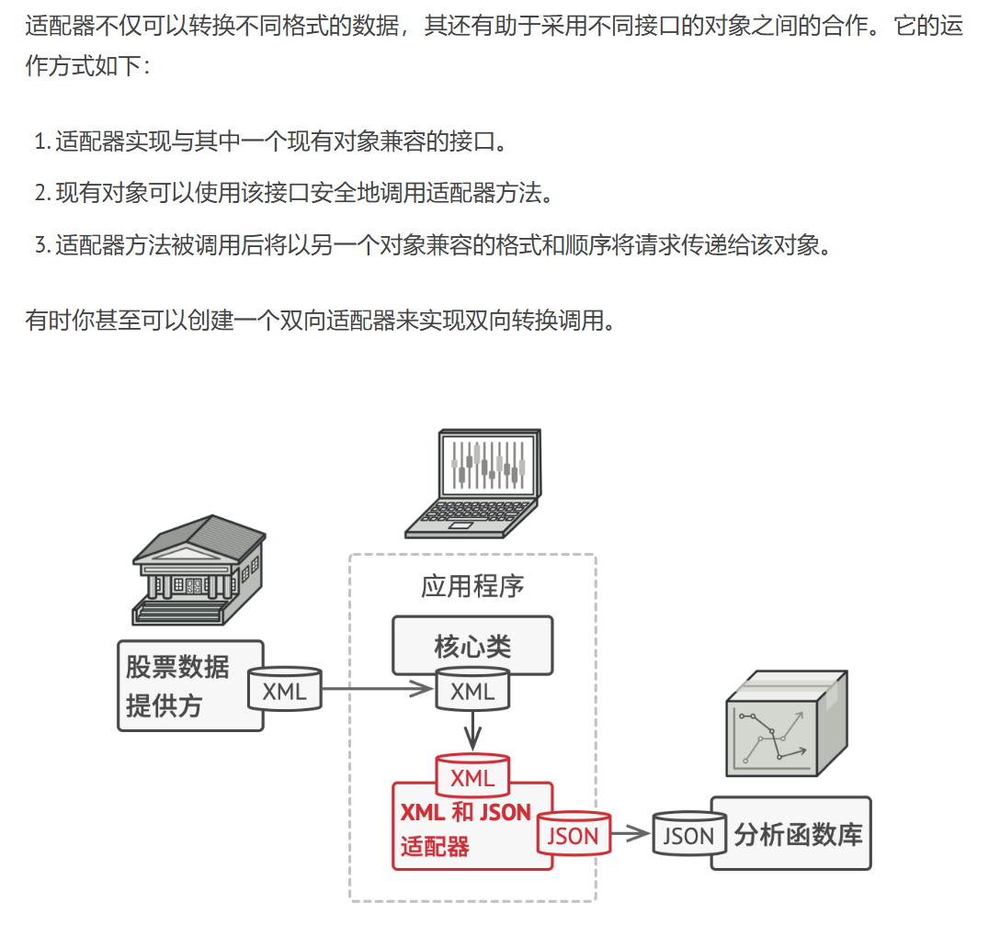
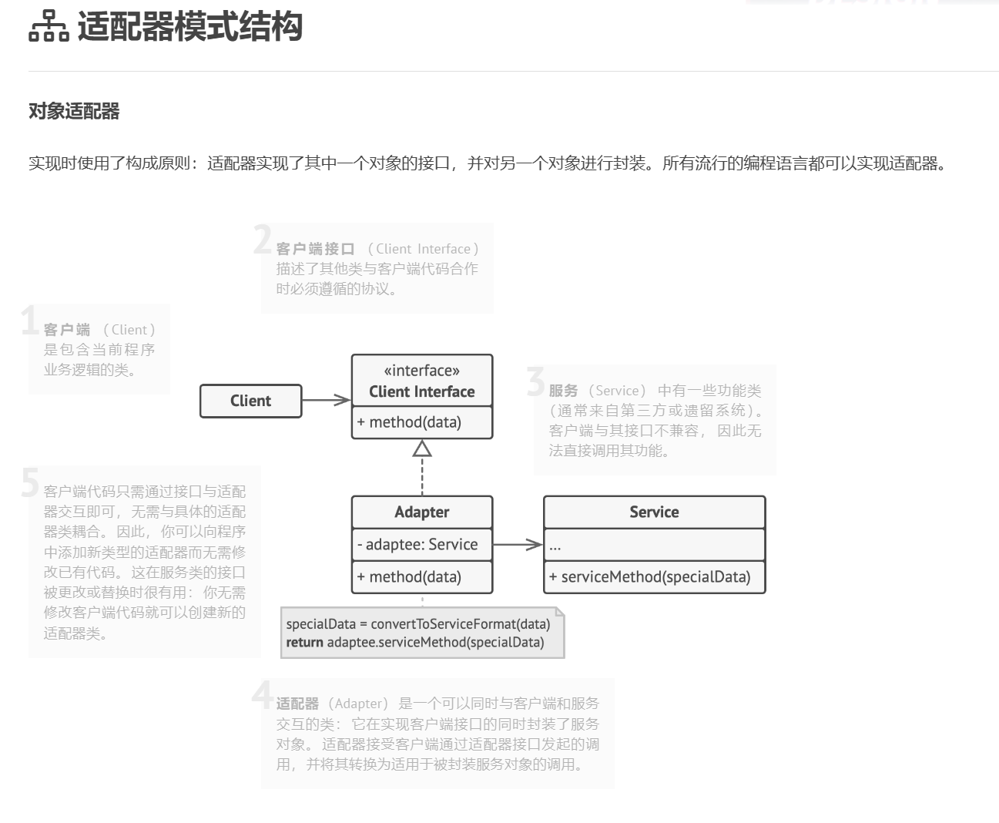
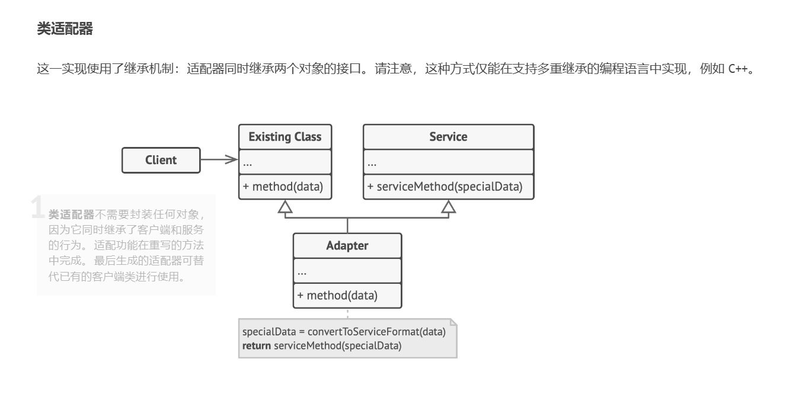
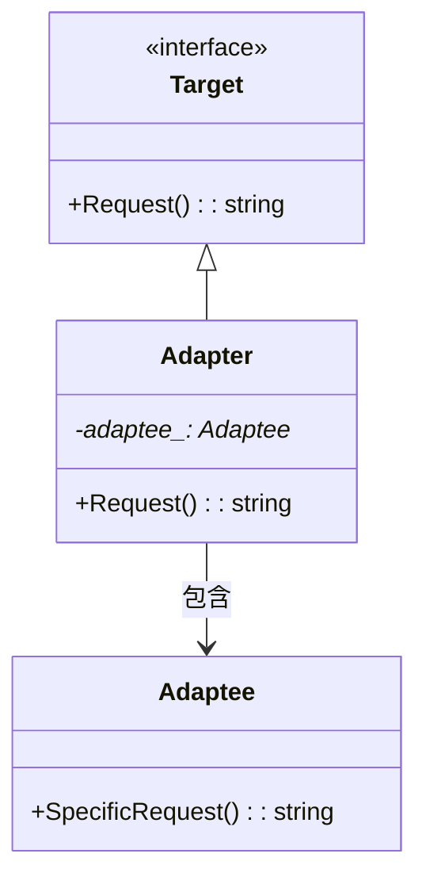

**适配器**是一种结构型设计模式， 它能使不兼容的对象能够相互合作。

适配器可担任两个对象间的封装器， 它会接收对于一个对象的调用， 并将其转换为另一个对象可识别的格式和接口。

**动机**
> - 在软件系统中，由于应用环境的变化，常常需要将"一些现存的对象"放入新的环境中应用，但新环境要求的接口是这些现存对象所不满足的。
> - 如何应对这种"迁移的变化"？如何既能利用现存对象的良好实现，又能满足新的应用环境所要求的接口？

**模式定义**
> 将一个类的接口转换成客户希望的另一个接口，Adapter模式使得原本由于接口不兼容而不能一起工作的那些类可以一起工作。

---



---




---

```C++
//目标接口（新接口）
class ITarget{
public:
    virtual void process()=0;
};

//遗留接口（老接口）
class IAdaptee{
public:
    virtual void foo(int data)=0;
    virtual int bar()=0;
};

//遗留类型
class OldClass: public IAdaptee{
    //....
};

//对象适配器
class Adapter: public ITarget{ //继承
protected:
    IAdaptee* pAdaptee;//组合
    
public:
    
    Adapter(IAdaptee* pAdaptee){
        this->pAdaptee=pAdaptee;
    }
    
    virtual void process(){
        int data=pAdaptee->bar();
        pAdaptee->foo(data);
        
    }
    
    
};


//类适配器
class Adapter: public ITarget,
               protected OldClass{ //多继承
               
               
}


int main(){
    IAdaptee* pAdaptee=new OldClass();
    
    
    ITarget* pTarget=new Adapter(pAdaptee);
    pTarget->process();
    
    
}


class stack{
    deqeue container;
    
};

class queue{
    deqeue container;
    
};

```

代码示例：

```cpp
#include <iostream>
#include <algorithm> // 用于std::reverse

/**
 * Target（目标接口）定义了客户端代码使用的领域特定接口
 */
class Target {
public:
    virtual ~Target() = default;

    virtual std::string Request() const {
        return "Target: 默认目标对象的标准行为";
    }
};

/**
 * Adaptee（被适配者）包含有用的功能，但其接口与现有客户端代码不兼容。
 * 被适配者在被客户端使用前需要进行适配
 */
class Adaptee {
public:
    std::string SpecificRequest() const {
        return ".eetpadA eht fo roivaheb laicepS"; // 需要反转的字符串
    }
};

/**
 * Adapter（适配器）使被适配者的接口与目标接口兼容
 * 通过继承目标接口并封装被适配者对象实现
 */
class Adapter : public Target {
private:
    Adaptee* adaptee_; // 被封装的被适配者对象

public:
    // 通过构造函数注入被适配者对象
    Adapter(Adaptee* adaptee) : adaptee_(adaptee) {}
    
    // 实现适配逻辑的核心方法
    std::string Request() const override {
        // 调用被适配者的特殊请求方法
        std::string to_reverse = this->adaptee_->SpecificRequest();
        
        // 进行接口转换（此处演示字符串反转适配）
        std::reverse(to_reverse.begin(), to_reverse.end());
        
        return "适配器: (转换结果) " + to_reverse;
    }
};

/**
 * 客户端代码支持所有遵循Target接口的类
 * 通过统一接口进行功能调用
 */
void ClientCode(const Target* target) {
    std::cout << target->Request();
}

int main() {
    // 演示标准目标对象的使用
    std::cout << "客户端: 可以直接使用目标对象:\n";
    Target* target = new Target;
    ClientCode(target);
    std::cout << "\n\n";

    // 展示被适配者接口不兼容的问题
    Adaptee* adaptee = new Adaptee;
    std::cout << "客户端: 被适配者类有不兼容的接口，无法直接理解:\n";
    std::cout << "被适配者: " << adaptee->SpecificRequest();
    std::cout << "\n\n";

    // 通过适配器进行接口转换
    std::cout << "客户端: 可以通过适配器使用被适配者:\n";
    Adapter* adapter = new Adapter(adaptee);
    ClientCode(adapter);
    std::cout << "\n";

    // 清理资源
    delete target;
    delete adaptee;
    delete adapter;

    return 0;
}
```

### 代码结构说明

1. **类关系**


2. **执行流程**
```
客户端调用目标接口
    |
    v
目标对象直接响应 (输出标准消息)
    |
    v
客户端尝试使用被适配者 (接口不兼容)
    |
    v
通过适配器转换接口 (字符串反转)
    |
    v
客户端通过适配器成功调用功能
```

3. **关键设计点**
- **目标接口 (Target)**：定义客户端期望的通用接口规范
- **被适配者 (Adaptee)**：包含实际功能但接口不兼容的遗留组件
- **适配器 (Adapter)**：
  - 继承目标接口保证类型兼容
  - 封装被适配者对象实现功能转换
  - 通过字符串反转演示接口转换逻辑

4. **输出结果**
```
客户端: 可以直接使用目标对象:
Target: 默认目标对象的标准行为

客户端: 被适配者类有不兼容的接口，无法直接理解:
被适配者: .eetpadA eht fo roivaheb laicepS

客户端: 可以通过适配器使用被适配者:
适配器: (转换结果) Special behavior of the Adaptee.
```

该实现演示了适配器模式的典型应用，通过接口转换使不兼容组件能够协同工作。