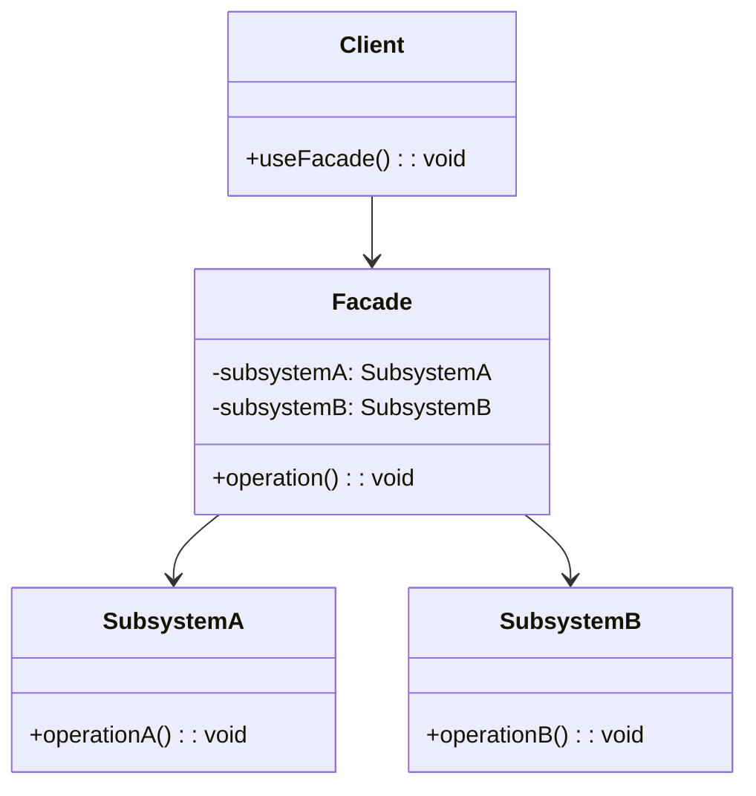

### **外观模式（Facade Pattern）详解**

#### **1. 模式定义**
**外观模式**是一种结构型设计模式，旨在为复杂的子系统提供一个**统一的简化接口**。它通过定义一个高层接口，隐藏子系统的复杂性，使客户端能够更轻松地使用系统功能。

---

#### **2. 解决的问题**
当系统包含多个复杂的子系统时：
- 客户端需要了解每个子系统的细节
- 子系统之间的依赖关系复杂
- 修改子系统可能影响客户端代码

**示例场景**：
- 家庭影院系统（包含投影仪、音响、灯光等）
- 文件压缩工具（包含压缩、解压、加密等功能）
- 电商订单系统（包含库存、支付、物流等模块）

---

#### **3. 模式结构**


---

#### **4. 核心组件**
| **角色**         | **职责**                                                                 |
|------------------|--------------------------------------------------------------------------|
| **Facade**       | 提供简化的高层接口，封装子系统的复杂性                                    |
| **Subsystem**    | 实现子系统的具体功能，外观模式不改变子系统的行为                          |
| **Client**       | 通过外观接口与子系统交互，无需了解子系统的内部细节                        |

---

#### **5. 代码示例（C++实现）**
**场景**：实现一个家庭影院系统，通过外观模式简化操作（如“看电影”只需调用一个方法）。

```cpp
#include <iostream>
#include <string>

// 子系统：投影仪
class Projector {
public:
    void on() {
        std::cout << "投影仪已打开\n";
    }

    void off() {
        std::cout << "投影仪已关闭\n";
    }

    void setInput(const std::string& input) {
        std::cout << "投影仪输入设置为: " << input << "\n";
    }
};

// 子系统：音响
class SoundSystem {
public:
    void on() {
        std::cout << "音响已打开\n";
    }

    void off() {
        std::cout << "音响已关闭\n";
    }

    void setVolume(int level) {
        std::cout << "音响音量设置为: " << level << "\n";
    }
};

// 子系统：灯光
class Lights {
public:
    void dim(int level) {
        std::cout << "灯光调暗至: " << level << "%\n";
    }

    void on() {
        std::cout << "灯光已打开\n";
    }

    void off() {
        std::cout << "灯光已关闭\n";
    }
};

// 外观类：家庭影院控制器
class HomeTheaterFacade {
private:
    Projector projector;
    SoundSystem soundSystem;
    Lights lights;

public:
    void watchMovie(const std::string& movie) {
        std::cout << "准备看电影: " << movie << "\n";
        lights.dim(10);
        projector.on();
        projector.setInput("HDMI");
        soundSystem.on();
        soundSystem.setVolume(50);
    }

    void endMovie() {
        std::cout << "结束观影\n";
        projector.off();
        soundSystem.off();
        lights.on();
    }
};

// 客户端代码
int main() {
    HomeTheaterFacade homeTheater;

    // 使用外观模式简化操作
    homeTheater.watchMovie("星际穿越");
    std::cout << "\n";
    homeTheater.endMovie();

    return 0;
}
```

**输出结果**：
```
准备看电影: 星际穿越
灯光调暗至: 10%
投影仪已打开
投影仪输入设置为: HDMI
音响已打开
音响音量设置为: 50

结束观影
投影仪已关闭
音响已关闭
灯光已打开
```

---

#### **6. 模式优势**
| **优势**         | **说明**                                                                 |
|------------------|--------------------------------------------------------------------------|
| **简化接口**     | 客户端只需与外观类交互，无需了解子系统的复杂性                            |
| **解耦客户端与子系统** | 客户端与子系统之间无直接依赖，子系统修改不影响客户端代码                  |
| **提高可维护性** | 将复杂逻辑集中在外观类中，便于维护和扩展                                  |
| **易于使用**     | 提供直观的高层接口，降低使用门槛                                          |

---

#### **7. 适用场景**
- **简化复杂系统**  
  例如：操作系统API、框架的入口类
- **分层架构**  
  例如：Web应用中的服务层封装数据访问层
- **遗留系统集成**  
  例如：为新系统提供统一接口调用旧系统功能

---

#### **8. 注意事项**
| **注意事项**       | **说明**                                                                 |
|--------------------|--------------------------------------------------------------------------|
| **外观类复杂度**   | 外观类可能成为“上帝对象”，需合理划分职责                                  |
| **过度封装**       | 避免隐藏过多细节，导致灵活性降低                                          |
| **性能开销**       | 外观类可能引入额外的调用层级，需权衡性能与易用性                          |

---

#### **9. 与其他模式对比**
| **模式**         | **核心思想**                              | **适用场景**                      |
|------------------|------------------------------------------|-----------------------------------|
| **外观模式**     | 提供简化接口封装复杂子系统                | 客户端需要简化调用复杂系统          |
| **中介者模式**   | 通过中介者集中管理对象交互                | 对象间存在复杂网状依赖关系          |
| **适配器模式**   | 转换接口使不兼容组件协同工作              | 集成旧系统或第三方库                |

---

通过外观模式，可以有效简化复杂系统的使用，提升代码的可维护性和可读性。在实际开发中，需根据具体场景权衡是否引入外观模式，避免过度封装。